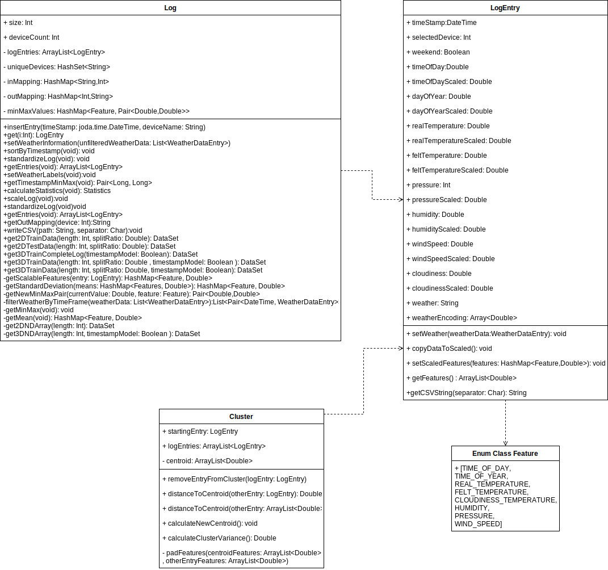
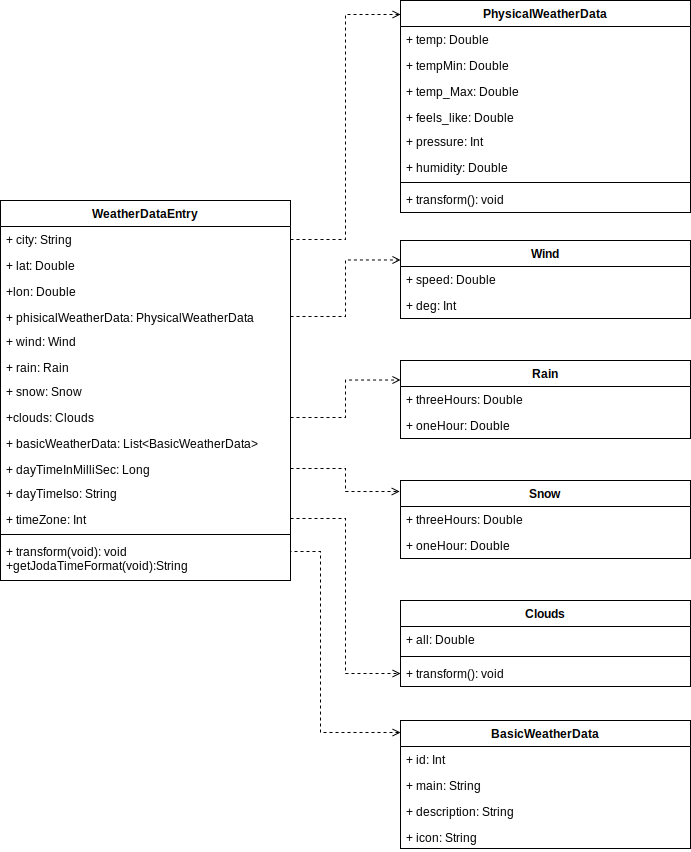
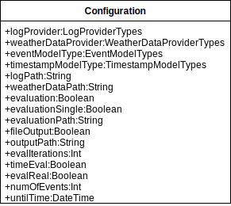
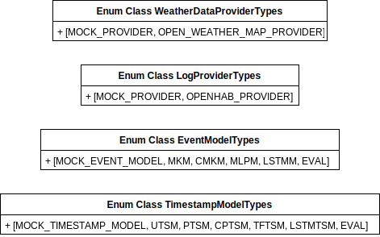

# Presence Simulation

Dieses Programm ist ein Prototyp zur Bachelorarbeit **Anwesenheitssimulation am Beispiel von OpenHAB**. Die Arbeit wurde
zur Erreichung des akademischen Grades Bachelor of Science an der Humboldt Universität zu Berlin angefertigt.

## Inhaltsverzeichnis

1. [Motivation](#motivation)
2. [Allgemeines](#allgemeines)
3. [Voraussetzungen](#voraussetzungen)
    1. [Kompilieren des Source Codes](#kompilieren-des-source-codes)
    2. [Hardware-Anforderungen](#hardware-anforderungen)
    3. [Software-Anforderungen](#software-anforderungen)
4. [Nutzung](#nutzung)
    1. [Aufruf](#aufruf)
    2. [Parameterübersicht](#parameterbersicht)
    3. [Parameterbeschreibung](#parameterbeschreibung)
    4. [Beispielaufrufe](#beispielaufrufe)
5. [Implementierungsdetails](#implementierungsdetails)
    1. [Allgemein](#allgemein)
    2. [Architektur](#architektur)
    3. [Third Party Bibliotheken](#third-party-bibliotheken)
6. [Data](#data)

## Motivation

Technologien zur Heimautomatisierung dringen immer mehr in die Häuser und Wohnungen von Menschen vor. Sie bieten Komfort
und Bequemlichkeit, bieten aber auch Beiträge zur Energieeffizienz und Sicherheit dieser Objekte. Dadurch entstehen
sogenannte Smart Homes, die durch den Einsatz verschiedenster, vernetzter Geräte eine Immobilie mit verschiedensten
Funktionen erweitern. Sei es nun automatisierte Beleuchtung oder Heizungssteuerung über Überwachungsanlagen oder
Rasenbewässerung. \
Die Arbeit wurde durch die Suche nach einer geeigneten Maßnahme zur Einbruchsprävention, mithilfe dieser vernetzten
Geräte innerhalb eines solchen Beispiels motiviert.

Man stelle sich das folgende Beispiel vor:\
Als Eigentümer eines Smart Homes möchte man verreisen. Da jedoch während dieser Zeit niemand zu Hause ist, könnte man
leicht Ziel eines Einbruchs werden. Daher möchte man erreichen, dass sich das Smart Home möglichst ähnlich zu den
täglichen Abläufen, des bewohnten Hauses verhält. Dadurch sollen mögliche Einbrecher getäuscht werden und der Eindruck
entstehen, dass man selbst zu Hause sei. Für den potentiellen Einbrecher sinkt somit die erwartete Chance erfolgreich zu
sein und gegebenenfalls sieht dieser von einem Einbruch ab.

Dieses Ziel verfolgt das Konzept der Anwesenheitssimulation in Smart Homes.

## Allgemeines

Dieses Programm ist als Proof of Concept zu verstehen. Das Ziel der Arbeit ist es, verschiedene Modelle zur Synthese von
Log-Daten in Smart Home Umgebungen zu betrachten und auf deren Tauglichkeit zu untersuchen. Diese Untersuchung wurde auf
der Basis von OpenHAB Log-Daten und synthetisch generierten Log-Daten durchgeführt.

Hierzu wurde dieser Prototyp entwickelt. Dieser verfügt über die Fähigkeit, basierend auf gegebenen Log-Dateien und
Wetter-Daten (in einer JSON-Datei), eine Anwesenheitssimulation als Commandline-Simulation oder als synthetisches
Log-Datei durchzuführen.\
Der Nutzer kann hierzu aus verschiedenen Modelltypen auswählen und diese zur Simulation nutzen. Die Qualität und der
Ressourcenverbrauch variiert zum Teil stark in Abhängigkeit vom gewählten Modell.\
Ebenfalls implementiert der Prototyp Funktionalitäten zur Evaluation der Güte der verschiedenen Modelle. Die hierbei
verwendeten Metriken können der Bachelorarbeit entnommen werden.

Aufgrund der Breite der verwendeten Modelle wurde im Rahmen der Arbeit keine Parameteroptimierung durchgeführt. Dies
hätte den Umfang der Arbeit überschritten. Auch stand zur Evaluation der Arbeit nur ein realer Datensatz zur Verfügung.
Eine zusätzliche Evaluation wurde zwar mittels synthetischer Daten durchgeführt, jedoch ist es im Bereich des Möglichen,
dass aufgrund dieser beiden Umstände, die Qualität der Log-Simulation bei Verwendung mit privaten Daten von den
Ergebnissen der Arbeit abweicht.

Die Ergebnisse der Arbeit legen nahe, dass zur privaten Verwendung am ehesten ein Cluster-basiertes Markov-Ketten-Modell
zur Aktivitätssynthese zusammen mit einem poissonverteilten Modell zur Zeitstempelerzeugung geeignet sind. Diese Modelle
liefern zum einen die besten Qualitäten (speziell auf realen Datensätzen) und zum anderen sind sie relative
ressourcenschonend.

## Voraussetzungen

### Kompilieren des Source Codes

Zur Erzeugung ausführbarer Artefakte ist in diesem Projekt ein Maven Build-Script, sowie ein Maven-Wrapper für Unix- und
Windows-Systeme enthalten.

Dieser Wrapper kann, nach Wechsel in das entsprechende Verzeichnis, mittels des Aufrufs: ``./mvnw package`` ausgeführt
werden. Der Wrapper übernimmt das Nachladen notwendiger Bibliotheken und Abhängigkeiten, kompiliert die implementierten
Klassen und packt diese zu einer ausführbaren Jar-Datei. Diese findet sich anschließend
unter ``./target/PresenceSimulation-0.1-jar-with-dependencies.jar``.

Zur Ausführung des Maven-Wrappers wird eine Java-SDK Version 11 benötigt. Diese ist auch die zur Entwicklung genutzte
JRE Target-Version. Das Projekt wurde mittels der Kotlin-Version ``1.4.0`` entwickelt.

Für die Kompilierung mithilfe des Maven Build-Scripts wird weiterhin eine aktuelle Version des Buildtools Maven
benötigt.

### Hardware-Anforderungen

Zum Erzeugen der Jar-Datei werden insgesamt mindestens 700 MB freier Festplattenspeicher benötigt.

Zur Ausführung der erzeugten Jar-Datei wird ein System mit ca. 12 GB RAM benötigt. Der Prototyp wurde sowohl auf einem
System mit AMD Ryzen 5 und Intel Xeon Prozessor E8-4880 getestet. Der Test mit einem Raspberry Pi 3B+ war nicht
erfolgreich, da aufgrund der eingeschränkten RAM-Resourcen des Systems die notwendingen Anforderung nicht erreicht
werden.

Die Lauffähigkeit auf anderen Prozessoren kann in der aktuellen Version eingeschränkt sein. Gegebenenfalls kann hier die
Einbindung einer alternativen DL4J-Backend-Bibliothek Abhilfe schaffen. Dies konnte jedoch nicht getestet werden.

### Software-Anforderungen

Um Lauffähig zu sein, benötigt der Prototyp eine installierte JRE mindestens der Version 11. Der Prototyp ist auf
Windows 10, openSUSE Leap 15.2 und Ubuntu 20.04 getestet worden und lauffähig. Darüber hinaus ist keine weitere
Vorinstallation notwendig.

## Nutzung

### Aufruf

Der Prototyp kann nach einem erfolgreichen Build über die Kommandozeile ausgeführt werden. Hierzu ist der Aufruf\
``java -jar PresenceSimulation-0.1-jar-with-dependencies.jar [Parameterliste]``, aus dem entsprechenden Verzeichnis
heraus, notwendig. Eine Übersicht über mögliche Parameter kann <u> [hier](#parameterbersicht)</u> eingesehen werden.

Danach werden die entsprechenden Daten, speziell die Log-Dateien und Wetter-Informationen, falls nötig eingelesen.
Anschließend werden die gewählten Modelle trainiert und die Simulation ausgeführt.

### Parameterübersicht

Der folgenden Tabelle können mögliche und notwendige Parameter entnommen werden. Eine detaillierte Beschreibung dieser
Parameter folgt sich im Anschluss.

Parameter|Optionsname bei Aufruf des Prototypen mittels Kommandozeile|mögliche Werte|notwendiger Parameter
----|------|----|:----:
[LogProvider](#logprovider)|``-logProvider``|````mock, openhab````|X
[WeatherDataProvider](#weatherdataprovider)|``-weatherDataProvider``|``mock, openweather``|X
[EventModelType](#eventmodeltype)|``-eventModel``|``mock, mkm, cmkm, mlp, lstm``|X
[TimestampModelType](#timestampmodeltype)|``-timestampModel``|``mock, utsm, ptsm, cptsm, tftsm, lstmtsm``|X
[LogPath](#logpath)|``-log``|String der den Pfad <br /> beschreibt, aus dem Logdaten extrahiert werden können.|X
[WeatherDataPath](#weatherdatapath)|``-weatherData``|String der den Pfad <br /> beschreibt, aus dem Wetterdaten extrahiert werden können.|X
[FileOutput](#fileoutput)|``-output``|Keiner erforderlich|
[OutputPath](#outputpath)|``-outputPath``|String der den Pfad <br /> beschreibt, in den  Ausgaben geschrieben werden sollen.|
[Evaluation](#evaluation)|``-eval``|Keiner erforderlich|
[EvaluationSingle](#evaluationsingle)|``-evalSingle``|Keiner erforderlich|
[EvaluationPath](#evaluationpath)|``-evalPath``| path to save generated files for evaluation|
[EvaluationIterations](#evaluationiterations)|``-evalIterations``|``[1...n]``|
[TimeEvaluation](#timeevaluation)|``-time``|Keiner erforderlich|
[RealLogEvaluation](#reallogevaluation)|``-real``|keiner erforderlich|
[NumberOfEvents](#numberofevents)|``-events``|``[1...n]``|
[UntilTime](#untiltime)|``-until``|``[1...n]``|

### Parameterbeschreibung

#### LogProvider

Dieser Parameter definiert eine Klasse zur Bereitstellung von Log-Daten aus einer Log-Datei. Er ist vorrangig für
mögliche Erweiterungen eingeführt worden. So könnten beispielsweise alternative Provider implementiert werden, um eine
Verallgemeinerung auf andere Log-Typen als OpenHAB-Log-Dateien zuzulassen.\
Aktuell besteht dabei die Auswahl zwischen
der [`MockLogProvider`](src/main/kotlin/org/maspitzner/presencesimulation/executors/logproviders/MockLogProvider.kt)
-Klasse und
der [`OpenHABLogProvider`](src/main/kotlin/org/maspitzner/presencesimulation/executors/logproviders/OpenHABLogProvider.kt)
-Klasse.
Die [`MockLogProvider`](src/main/kotlin/org/maspitzner/presencesimulation/executors/logproviders/MockLogProvider.kt)
-Klasse ist jedoch nur für Debug-Zwecke implementiert und hat keine sinnvolle Außenwirkung.\
Bei möglichen späteren Erweiterungen müssen alternative Implementierungen das
Interface [`LogProvider`](src/main/kotlin/org/maspitzner/presencesimulation/executors/logproviders/LogProvider.kt)
implementieren.

<u>Die Spezifizierung dieser Option ist für den Betrieb des Prototypen zwingend erforderlich.</u>

#### WeatherDataProvider

Dieser Parameter definiert eine Klasse zur Bereitstellung von Wetterdaten. Er ist ebenfalls eingeführt worden um, eine
einfache Erweiterbarkeit zu gewährleisten. In seiner derzeitigen Form bezieht der Prototyp benötigte Wetterdaten aus
einem [History Bulk](https://openweathermap.org/history), welcher von [OpenWeather(TM)](https://openweathermap.org/)
bezogen ist. Diese Datei ist im JSON-Format bereitgestellt. Diese notwendige Funktionalität könnte durch eine
Erweiterung, beispielsweise auch durch Log-interne Wetterdaten (falls in dem Smart Home notwendige Sensoren vorhanden
sind) gewährleistet werden.\
Bei diesem Provider besteht in der derzeitigen Version die Auswahl zwischen
der [`MockWeatherDataProvider`](src/main/kotlin/org/maspitzner/presencesimulation/executors/weatherdataproviders/MockWeatherDataProvider.kt)
-Klasse und
der[`OpenWeatherMapProvider`](src/main/kotlin/org/maspitzner/presencesimulation/executors/weatherdataproviders/OpenWeatherMapProvider.kt)
-Klasse. Auch hier gilt,
dass [`MockWeatherDataProvider`](src/main/kotlin/org/maspitzner/presencesimulation/executors/weatherdataproviders/MockWeatherDataProvider.kt)
-Klasse ist jedoch nur für Debug-Zwecke implementiert und hat keine sinnvolle Außenwirkung.\
Spätere, alternative Implementierungen müssen das
Interface [`WeatherProvider`](src/main/kotlin/org/maspitzner/presencesimulation/executors/weatherdataproviders/WeatherProvider.kt)
implementieren.

<u>Die Spezifizierung dieser Option ist für den Betrieb des Prototypen zwingend erforderlich.</u>

#### EventModelType

Diese Option dient der Auswahl eines Modells zur Gerätelabelsynthese. Die Auswahlmöglichkeiten hierbei sind:

* ``mkm`` - diese wählt
  das [Markov-Ketten-Modell](src/main/kotlin/org/maspitzner/presencesimulation/simulation/events/MarkovModel.kt) aus.
  Dabei werden aus den gegebenen Trainingsdaten Markov-Ketten berechnet. Diese werden anschließend durchlaufen, um die
  Sequenz von simulierten Gerätelabeln zu erzeugen.


* ``cmkm`` - diese wählt
  das [Cluster-basierte Markov-Ketten-Modell](src/main/kotlin/org/maspitzner/presencesimulation/simulation/events/ClusterBasedMarkovModel.kt)
  aus. Hierbei werden zunächst die Trainingsdaten in Cluster mithilfe des k-means-Algorithmus aufgeteilt. Anschließend
  wird für jeden Cluster ein ``mkm`` erzeugt.


* ``mlp`` - diese wählt
  das [Multilayer Perceptron Modell](src/main/kotlin/org/maspitzner/presencesimulation/simulation/events/MLPModel.kt)
  aus. Hierbei wird ein Multilayer Perceptron (MLP), auf den Log- und Wetterdaten trainiert und anschließend dazu
  verwendet, Gerätelabel zu berechnen.


* ``lstm`` - diese wählt
  das [LSTM-Modell](src/main/kotlin/org/maspitzner/presencesimulation/simulation/events/LSTMModel.kt) aus. Auch für
  diesesModell wird ein künstliches neuronales Netz, ein sogenanntes LSTM-Netz auf den gegebenen Daten trainiert und zur
  Gerätelabelsynthese verwendet. Dieser Typ von künstlichem neuronalen Netz ist besser geeignet zeitliche Abhängigkeiten
  innerhalb der Daten zu modellieren als ein MLP.


* ``mock`` - diese wählt ein Mock-Modell aus (bei Verwendung zur Evaluation aller Modelle oder bei Evaluation einzelner
  Zeitstempelmodelle)

Die Ergebnisse der Arbeit legen nahe, dass zumindest im aktuellen Zustand des Prototyps, die Auswahl ``cmkm`` die
höchste Qualität erzeugt. Die Auswahl ``mkm`` erzeugt ähnlich gute Ergebnisse. Sollte keinerlei Resource- oder
Zeitbeschränkung vorhanden sein, so kann auch die Auswahl ``lstm`` geeignet sein.

<u>Die Spezifizierung dieser Option ist für den Betrieb des Prototypen zwingend erforderlich.</u>

#### TimestampModelType

Mithilfe dieser Option kann der Nutzer die Auswahl eines Modells zur Zeitstempelsynthese festlegen. Die Möglichkeiten
sind dabei:

* ``utsm`` - diese wählt ein Modell zur Erzeugung gleichverteilter Zufallszahlen als Zeit zwischen einzelnen Events aus.


* ``ptsm`` - wie bei ``utsm``, hier werden jedoch poissonverteilte Zufallszahlen verwendet.


* ``cptsm`` - wie bei ``ptsm``, jedoch werden hierbei zuvor die Ruhezeiten in Klassen unterteilt und für jede Klasse ein
  separater Zufallszahlengenerator erzeugt.


* ``tftsm`` - wie bei ``ptsm``. Zusätzlich werden Kernaktivitätszeitfenster erzeugt, innerhalb derer die Events liegen.
  Dies soll Aktivitäten außerhalb der üblichen Zeiten (bspw. Nachts) verhindern.


* ``lstmtsm`` - durch diese Option wird ein LSTM-basiertes Zeitstempelmodell gewählt. Dabei erfolgt ein Training eines
  LSTM künstlichen neuronalen Netzes welches dann zur Erzeugung nachfolgender Zeitstempel genutzt wird. Dieses Modell
  benötigt eine deutlich längere Trainingszeit als die anderen Modelle.


* ``mock`` - diese wählt ein Mock-Modell aus (bei Verwendung zur Evaluation aller Modelle oder bei Evaluation einzelner
  Gerätelabelmodelle)

Die Ergebnisse der Arbeit legen nahe, dass zumindest im aktuellen Zustand des Prototyps, die Auswahl  ``ptsm`` die
höchste Qualität erzeugt.

<u>Die Spezifizierung dieser Option ist für den Betrieb des Prototypen zwingend erforderlich.</u>

#### LogPath

Diese Option gibt den Pfad an, unter dem die Log-Daten für das Training der Modelle gefunden werden kann. Es kann eine
einzelne Datei oder ein Verzeichnis angegeben werden. Der angegebene Pfad muss existieren und die jeweiligen Datei/-en
müssen für den Prototyp lesbar sein.

Der Inhalt der Log-Daten muss bei Verwendung des aktuell implementierten
LogProvider [`OpenHABLogProvider`](src/main/kotlin/org/maspitzner/presencesimulation/executors/logproviders/OpenHABLogProvider.kt)
dem folgendem Format entsprechen:

``Zeitstempel [Eventtyp] - Gerätename changed from alterStatus to neuerStatus``.

<u>Die Spezifizierung dieser Option ist für den Betrieb des Prototypen zwingend erforderlich.</u>

#### WeatherDataPath

Diese Option gibt in der aktuellen Version des Prototyps an, aus welcher Datei notwendige Wetterdaten gelesen werden
können. Diese stammen, im Rahmen dieses Proofs of Concept, von [OpenWeather(TM)](https://openweathermap.org/). Die Daten
müssen in dem [hier](https://openweathermap.org/history) spezifizierten JSON-Format vorliegen.

<u>Die Spezifizierung dieser Option ist für den Betrieb des Prototypen zwingend erforderlich.</u>

#### FileOutput

Bei dieser Option handelt es sich um einen bool'schen Parameter, der durch Setzten der Option auf ``true`` gesetzt wird
Die Option bewirkt, dass die Ausgabe einer Simulation eines Logs statt auf der Kommandozeile zu erscheinen in eine Datei
geschrieben wird.

Die der Standardpfad der Ausgabe ist in diesem Fall:
``./logOutput/generatedLog.log``

#### OutputPath

Diese Option kann genutzt werden um, einen benutzerdefinierten Ausgabepfad zu bestimmen. Der gesetzte Ausgabepfad
ersetzt den Standardpfad ``./logOutput/generatedLog.log``. Der gesetzte Pfad muss eine String-Representation einens
Dateipfades sein, der für den Prototyp schreibbar ist. Der angegebene Pfad muss ein absoluter Pfad sein.

#### Evaluation

Wenn diese Option angegeben ist, dann wird eine Evaluation durchgeführt. Dieser Parameter benötigt keinen angegebenen
Wert. Es handelt sich hierbei um einen bool'schen Wert, der auf ``true`` gesetzt wird, wenn die Option vorhanden ist.
Zusätzlich zu dieser Option können weiterhin die Optionen [EvaluationSingle](#evaluationsingle)
, [EvaluationPath](#evaluationpath), [TimeEvaluation](#timeevaluation)
und [RealLogEvaluation](#reallogevaluation) ausgewählt werden, um das Verhalten der Evaluation weiter anzupassen. Die
Auswahl einer Anzahl an Evaluationsiterationen mittels [EvaluationIteration](#evaluationiterations) ist notwendig, außer
bei Auswahl von [RealLogEvaluation](#reallogevaluation).

#### EvaluationSingle

Diese Option löst eine Evaluation eines einzelnen Gerätelabel-Modells oder Zeitstempel-Modells aus. Dieser Parameter
benötigt keinen angegebenen Wert. Es handelt sich hierbei um einen bool'schen Wert, der auf ``true`` gesetzt wird, wenn
die Option vorhanden ist. Wenn diese Option ausgewählt ist, dann muss auch ein anderes Modell als das jeweilige
Mock-Modell ausgewählt werden.

#### EvaluationPath

Hierbei handelt es sich um eine Option zur Bestimmung des Ausgabepfads während eines Evaluationsruns. Standardmäßig ist
eine Ausgabe in das Verzeichnis angedacht, in dem sich auch die ausführbare Datei befindet. Dabei entsteht folgende
Verzeichnisstruktur:

```
evaluationPath/
|__simout/
  |__evaluation/
     |__groundtruth/ 
     |  |__fewZipfianLog/
     |  |__largeFewUniformLog/
     |  |__largeManyUniformLog/
     |  |__manyZipfianLog/
     |  |__smallFewUniformLog/
     |  |__smallManyUniformLog/
     |  |__(realLog)/
     |
     |__models/
     |  |__BasicMarkov/
     |  |  |__*
     |  |  
     |  |__ClusteredMarkov/
     |  |  |__*
     |  |  
     |  |__LSTM/
     |  |  |__*
     |  |  
     |  |__MLP/
     |     |__*
     |    
     |__timestampGenrators/
        |__ClassBasedPoissonGenerator
        |  |__*
        |  
        |__PoissonGenerator
        |  |__*
        |    
        |__TimeFrameGenerator
        |  |__*
        |  
        |__LSTMGenerator
        |  |__*
        |  
        |__UniformGenerator
           |__*
    
```

Dabei steht `*` für den, bereits unter, `groundtruth/` aufgeführten Unterbaum. Jedes Verzeichnis dieses Unterbaums
enthält dann die erzeugten `(0-n).result`- bzw. `(0-n).log`-Dateien.

#### EvaluationIterations

Diese Option bestimmt die Anzahl der Evaluationsiterationen. Hierzu muss eine Ganzzahl als Wert angegeben werden.

#### TimeEvaluation

Diese Option löst eine Evaluation der Laufzeit des Trainings der Modelle aus. Sie kann in Kombination
mit [EvaluationSingle](#evaluationsingle) verwendet werden. Dieser Parameter benötigt keinen angegebenen Wert. Es
handelt sich hierbei um einen bool'schen Wert, der auf ``true`` gesetzt wird, wenn die Option vorhanden ist.

#### RealLogEvaluation

Diese Option löst eine Evaluation eines mithilfe eines gegebenen realen Logs aus. Dieser Parameter benötigt erneut, aus
demselben Grund, keinen angegebenen Wert. Bei einer solchen Evaluation wird immer nur eine Evaluationsiteration
durchgeführt.

#### NumberOfEvents

Mit dieser Option kann eine Anzahl an Events festgelegt werden, die die Simulation erzeugt. So werden bei einem Aufruf
mit der Option: ```-events 1000``` 1000 Events simuliert. Hierbei ist ein Wert von 100 Events als Standard festgesetzt.

#### UntilTime

Durch Angabe eines natürlichen Zahlenwertes für diesen Parameter lässt sich eine Dauer in Stunden angeben, die die
Simulation wenigstens Dauern soll. Beispielweise sorgt die Bestimmung des Parameters ``-until 24`` für eine Simulation,
welche vom Zeitpunkt des Aufrufs, Events erzeugt, sodass der letzte Zeitstempel nicht früher als einen Tag später liegt.

### Beispielaufrufe:

#### Simulationsaufruf

Der
Aufruf ``java -jar PresenceSimulation-0.1-jar-with-dependencies.jar -logProvider openhab -weatherDataProvider openweather -eventModel cmkm -timestampModel ptsm -log /smarthome/logs/ -weatherData /WeatherData/WeatherData.json -events 100``
löst einen durchlauf des Prototyps mit einem Cluster-basiertem Markov-Ketten-Model und einem poissonverteilten
Zeitstempelmodel aus. Die Log-Dateien werden dabei aus dem relativen Verzeichnis ``./smarthome/logs/`` bezogen. Die
Wetterdaten werden dabei aus der Datei
``./WeatherData/WeatherData.json`` bezogen. Bei diesem Aufruf werden Daten eines OpenHAB-Systems und Wetterdaten
von [OpenWeather(TM)](https://openweathermap.org/) verwendet. Dabei werden insgesamt 1000 Events simuliert.

Bei dem sehr ähnlichen
Aufruf ``java -jar PresenceSimulation-0.1-jar-with-dependencies.jar -logProvider openhab -weatherDataProvider openweather -eventModel cmkm -timestampModel ptsm -log /smarthome/logs/ -weatherData /WeatherData/WeatherData.json -output -outputPath ~/data/simulatedLog.log``
handelt es sich um die gleiche Simulation. Der Unterschied besteht dabei darin, dass die Ergebnisse der Simulation in
die Datei ``~/data/simulatedLog.log`` geschrieben werden.

#### Evaluationsaufruf

Ein möglicher Aufruf zum Starten einer vollständigen Evaluation (alle Modelle) über 10 Evaluationsiteration kann wie
folgt aussehen:  
``
java -jar PresenceSimulation.jar -logProvider openhab -weatherDataProvider openweather -eventModel mock -timestampModel mock -log "/smarthome/log" -weatherData "/WeatherData/WeatherData.json" -eval -evalIterations 1O
``.

Sollten eine Evaluation eines einzelnen Modells gewünscht werden, so kann der Aufruf wie folgt angepasst werden:
``
java -jar PresenceSimulation.jar -logProvider openhab -weatherDataProvider openweather -eventModel mkm -timestampModel mock -log "/smarthome/log" -weatherData "/WeatherData/WeatherData.json" -eval -evalIterations 1O -evalSingle
``.

Bei diesem Aufruf wird ein Markov-Ketten-Modell über 10 Evaluationsiterationen evaluiert.

Ein Evaluationsdurchlauf zur Ermittlung der Laufzeit des Trainings aller Modell kann mit
``
java -jar PresenceSimulation.jar -logProvider openhab -weatherDataProvider openweather -eventModel mock -timestampModel mock -log "/smarthome/log" -weatherData "/WeatherData/WeatherData.json" -eval -evalIterations 1O -time
``.

gestartet werden.

## Implementierungsdetails

### Allgemein

Der Prototyp wurde in [Kotlin](https://kotlinlang.org/) implementiert. Dabei handelt es sich um eine Hochsprache die zu
unter anderem JVM-Bytecode kompiliert werden kann. es wurden verschiedene Third-Party Bibliotheken verwendet. Weitere
Informationen zu diesen finden sich [hier](#third-party-bibliotheken). Die Grundlage für diese Entscheidung bildet dabei
die Tatsache, dass OpenHAB-Systeme in JVM-fähigen Umgebungen laufen.

Zusätzlich wurde die Architektur konzeptionell [hier](#architektur) beschrieben.

### Architektur

Grundsätzlich basiert die Umsetzung des Prototypen auf zwei grundlegenenden Funktionalitäten.

Zum einen wurde ein Evaluator-Konzept bestimmt, dass alle Funktionen im Kontext der Evaluation der implementierten
Modelle organisiert. In unter diesem Konzept wird die Erzeugung von Evaluationsdaten und deren Auswertung hinsichtlich
der Zeitstempel- und Labelsimmulationsqualität vereinigt. Zusätzlich beinhaltet es auch die Ermittlung von
Trainingslaufzeiten.

Auf der anderen Seite wurde ein Simulator-Konzept entwickelt. Hierunter lassen sich alle Funktionalitäten zur
Durchführung einer Simulation zusammenfassen. Darunter wird auch die Zuführung von Daten (wie z.B. Log- und
Wetterinformationen)
in da System zusammengefasst.

#### Gesamtarchitektur
Ein Überblick über die Gesamtarchitektur kann der folgenden Grafik entnommen werden:

![Gesamtarchitektur][1]
Die Grafik kann als .svg-Datei, für etwaige Vergrößerungen etc. [hier](docassets/ArchitecturalOverview.svg) gefunden
werden.

Es wurden auch verschiedene, zusätzliche Datenstrukturen implementiert. Zunächst betrachten wir Datenstrukturen, die im
Zusammenhang mit der Datenhaltung von Log- und Wetterinformationen stehen:

#### [LogEntry](src/main/kotlin/org/maspitzner/presencesimulation/models/LogEntry.kt)

Dieser Datentyp vereinigt alle Informationen, die zu einem Event verfügbar sind. Beispielsweise Zeitstempel, Gerätelabel
und Wetterinformationen. Zusätzlich enthält dieser Min-Max-normalisierte Repräsentationen dieser Werte für spätere
Lernverfahren.

#### [Log](src/main/kotlin/org/maspitzner/presencesimulation/models/Log.kt)

Der Datentyp Log vereinigt eine, nach Zeitstempel sortierte, Menge
von [LogEntry](#logentrysrcmainkotlinorgmaspitznerpresencesimulationmodelslogentrykt)-Objekten. Zusätzlich bietet diese
Klasse Funktionalitäten wie beispielsweise die Möglichkeit der Normalisierung des Logs oder die Erzeugung von
NDArray-Repräsentationen des Logs zum Training von DL4J-Modellen.

#### [Feature](src/main/kotlin/org/maspitzner/presencesimulation/models/Feature.kt)

Diese Enum-Klasse repräsentiert alle zum Training von Modellen zur Verfügung stehenden Features
der [LogEntry](#logentrysrcmainkotlinorgmaspitznerpresencesimulationmodelslogentrykt)-Klasse.

#### [Cluster](src/main/kotlin/org/maspitzner/presencesimulation/models/Cluster.kt)

Die Cluster-Klasse bietet ein Abstraktionslevel und Funktionalitäten für den K-Means-Algorithmus. Speziell kann diese
Klasse genutzt werden um euklidische Distanzen zu dem jeweiligen Cluster-Mittelpunkt zu berechnen oder die
Cluster-Zugehörigkeit eines LogEntry-Objektes zu manipulieren.

Die Abhängigkeiten zwischen diesen einzelnen Klassen kann wie folgt dargestellt werden:

<p align="center">
  
</p>

Die Grafik kann als .svg-Datei, für etwaige Vergrößerungen etc. [hier](docassets/BasicDataTypesLogData.svg) gefunden
werden.

#### [WeatherDataEntry](src/main/kotlin/org/maspitzner/presencesimulation/models/WeatherDataEntry.kt)

Bei dieser Klasse handelt es sich um eine reine Daten-Repräsentation, die durch
das [o.g. Wetterdatenformat](#weatherdataprovider)
bestimmt wird. Sie wird genutzt, um das JSON-Format in einen Typen-sicheren Zustand zu parsen.

<p align="center">
  
</p>

Die Grafik kann als .svg-Datei, für etwaige Vergrößerungen etc. [hier](docassets/BasicDataTypesWeatherData.svg) gefunden
werden.

#### [Configuration](src/main/kotlin/org/maspitzner/presencesimulation/utils/configuration/Configuration.kt)

Diese Klasse kapselt alle möglichen Konfigurationsparameter. Sie wird genutzt, um das Verhalten anderer Klassen an das
gewünschte Verhalten anzupassen.

<p align="center">
  
</p>

Die Grafik kann als .svg-Datei, für etwaige Vergrößerungen etc. [hier](docassets/BasicDataTypesConfiguration.svg)
gefunden werden.

#### [Typ-Enum-Klassen](src/main/kotlin/org/maspitzner/presencesimulation/utils/configuration)

Zusätzlich wurden verschiedene Enum-Klassen implementiert, die die Bestimmung zu verwendender Klassen vereinfachen.
Dabei wurden für folgende Klassen Typen-Enum-Klassen erstellt:
1.[Gerätelabel-Modelle](src/main/kotlin/org/maspitzner/presencesimulation/utils/configuration/EventModelTypes.kt)
2.[Zeitstempel-Modelle](src/main/kotlin/org/maspitzner/presencesimulation/utils/configuration/TimestampModelTypes.kt)
3.[LogProvider](src/main/kotlin/org/maspitzner/presencesimulation/utils/configuration/LogProviderTypes.kt)
4.[WeatherDataProvider](src/main/kotlin/org/maspitzner/presencesimulation/utils/configuration/WeatherDataProviderTypes.kt)

Die möglichen Werte dieser Enum-Klassen können der folgenden Grafik oder [hier](#parameterbersicht) entnommen werden.

<p align="center">
  
</p>

Die Grafik kann als .svg-Datei, für etwaige Vergrößerungen etc. [hier](docassets/TypeEnumClasses.svg)
gefunden werden.

Zusätzlich wurden Funktionalitäten in einer Subarchitektur zusammengefasst, die das Training und die Benutzung der in
der Thesis beschriebenen Modelle betrifft. Dabei wurde zwischen Modellen zur Synthese von Zeitstempeln und Modellen zur
Erzeugung von Gerätelabels unterschieden.

Für die Menge der Modelle zur Gerätelabelsynthese wurden dabei zwei Interfaces entworfen:

1. [Model](src/main/kotlin/org/maspitzner/presencesimulation/simulation/events/Model.kt)
2. [StatefulModel](src/main/kotlin/org/maspitzner/presencesimulation/simulation/events/StatefulModel.kt)

Dabei ist [StatfulModel](src/main/kotlin/org/maspitzner/presencesimulation/simulation/events/StatefulModel.kt) eine
Spezialisierung des [Model](src/main/kotlin/org/maspitzner/presencesimulation/simulation/events/Model.kt)-Interfaces.

Die einzelnen Modelle zur müssen eines dieser Interfaces umsetzen. Die genaue Umsetzung bezüglich der einzelnen Modelle
kann dabei der Übersicht der [Gesamtarchitektur](#gesamtarchitektur) entnommen werden.

Für die Synthese der einzelnen Zeitstempel wurden drei Interfaces erstellt:

1. [TimestampGenerator](src/main/kotlin/org/maspitzner/presencesimulation/simulation/timestamps/TimestampGenerator.kt)
2. [FitableTimestampGenerator](src/main/kotlin/org/maspitzner/presencesimulation/simulation/timestamps/FitableTimestampGenerator.kt)
3. [StatefulTimestampGenerator](src/main/kotlin/org/maspitzner/presencesimulation/simulation/timestamps/StatefulTimestampGenerator.kt)

Auch hier sind die Letzteren Spezialisierungen des TimestampGenerators. Ebenso gilt, dass alle Modelle mindestens eines
der Interfaces implementieren müssen. Auch hier können genaue Details, welches Modell welche Interfaces implementiert,
der
[Gesamtarchitektur](#gesamtarchitektur) entnommen werden.

Zusätzlich wurden verschiedene Parser, Util-Funktionalitäten und Ähnliches implementiert. Diese werden jedoch nicht
weiter in der Architektur aufgeführt.

Abschließend sei zu der Architektur gesagt, dass die Architektur so gewählt wurde, um etwaige Erweiterungen zu
ermöglichen. Ein nachfolgender Entwickler könnte beispielsweise alternative Modelle oder Heimautomatisierungssysteme
ergänzen.

### Third-Party Bibliotheken

Zur Implementierung dieses Prototype wurden verschiedene Bibliotheken verwendet.

Zunächst wurde zum Parsen der JSON-Daten des History Bulks von [OpenWeather(TM)](https://openweathermap.org/)
die Third-Party Bibliothek [Gson](https://github.com/google/gson) verwendet. Dabei handelt es sich um eine Bibliothek
zum (De-)Serialisieren von Java-Objekten zu JSON-Strings und umgekehrt. Die Bibliothek wurde von Google Inc. unter
[Apache License Version 2.0](https://www.apache.org/licenses/LICENSE-2.0) veröffentlicht.

Zudem wurde [Joda-Time](https://github.com/JodaOrg/joda-time) verwendet. Diese Bibliothek stellt eine Alternative zu den
Java-Klassen zum Umgang mit Zeit dar. Auch wenn diese Bibliothek nicht mehr aktiv weiterentwickelt wird, bietet sie
verwenden wir diese hier dennoch, falls mögliche Erweiterungen Umgebungen verwenden sollten, in denen keine Java
Versionen ab SE 8 verfügbar sind. Sie wurde ebenfalls
unter [Apache License Version 2.0](https://www.apache.org/licenses/LICENSE-2.0) veröffentlicht.

Die im Prototypen verwendeten Poisson-Zufallsgeneratoren stammen aus
der [Apache Commons Math](https://github.com/apache/commons-math) Bibliothek. Diese Bibliothek stellt Funktionalitäten
für häufige mathematische Probleme, wie zum Beispiel Kurven-Fitting, Komplexe Zahlen oder eben stochastische Probleme,
zur Verfügung.
[Apache Commons Math](https://github.com/apache/commons-math) wurde ebenfalls unter
der [Apache License Version 2.0](https://www.apache.org/licenses/LICENSE-2.0) veröffentlicht.

Zur Implementierung der Modelle die auf künstlichen neuronalen Netzen basieren wurden die beiden
Bibliotheken [Deeplearning4J(DL4J)](https://github.com/eclipse/deeplearning4j)
und [ND4J](https://github.com/deeplearning4j/nd4j)
verwendet. [DL4J](https://github.com/eclipse/deeplearning4j) bietet dabei ein einfaches Interface zur Implementierung
und Nutzung künstlicher neuronaler Netze. Dabei bildet die Bibliothek [ND4J](https://github.com/deeplearning4j/nd4j)
die von [DL4J](https://github.com/eclipse/deeplearning4j) benötigten Fähigkeiten für mathematische Operationen ab. Diese
beiden Bibliotheken sind ebenfalls unter der [Apache License Version 2.0](https://www.apache.org/licenses/LICENSE-2.0)
verfügbar. Diese Bibliotheken verwenden zusätzlich die [SLF4J](http://www.slf4j.org/index.html) oder "Simple Logging
Facade for Java"
von [QOS](http://www.qos.ch/shop/index;jsessionid=DFC6AA8585558E46CDDBF050AADBEE25). Hierbei handelt es sich um eine
Vereinheitlichung verschiedener Logging-Bibliotheken für den einfachen Umgang mit Logging. SLF4J wurde unter der MIT
License veröffentlicht und ist von der Apache Software Foundation als mit Apache Software Licenses
kompatibel [anerkannt](http://www.slf4j.org/license.html).

Abschließend sei die Verwendung
der [PowerLaw-Klasse](src/main/kotlin/org/maspitzner/presencesimulation/utils/datahandling/PowerLaw.kt)
von Weishuai Yang erwähnt. Diese entstammt dem gps.util-Package
des [P2PSim-Projekts](http://www.cs.binghamton.edu/~wyang/gps/javadoc/overview-summary.html)
der [Binghamton University](https://www.binghamton.edu/computer-science/index.html). Sie wird zur Erzeugung
zipf-verteilter Label in Evaluationslogs verwendet. Die ursprüngliche Klasse basiert auf T J Finney's Manuscripts
Simulation Tool, 2001.

## Data

Wie bereits angesprochen enthält das Projekt Wetterdaten. Diese wurden von OpenWeather ® unter der Open Data Commons
Open Database License (ODbL) veröffentlicht. Der Datensatz ist [hier](data/WeatherData.zip) unter derselben Lizenz zur
Verfügung gestellt.


[1]:docassets/ArchitecturalOverview.svg